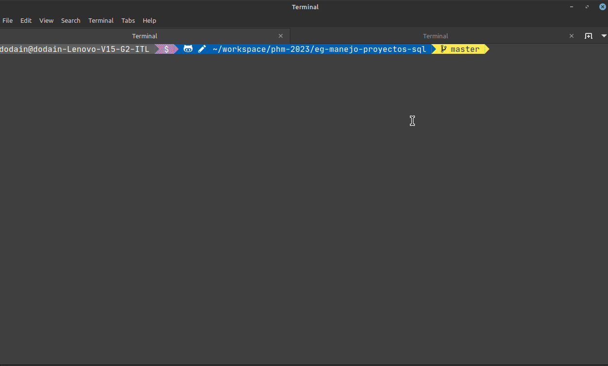
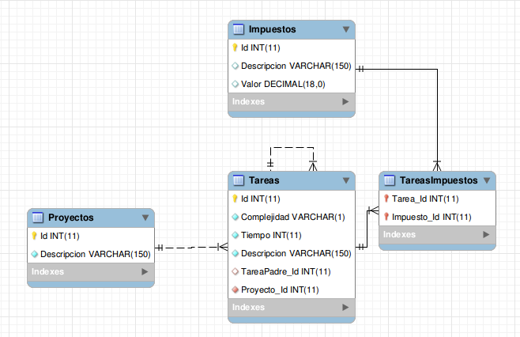

# Manejo de proyectos - componentes en RDBMS


## Prerrequisitos

Solo hace falta tener instalado Docker Desktop (el pack docker engine y docker compose), seguí las instrucciones de [esta página](https://phm.uqbar-project.org/material/software) en el párrafo `Docker`.

## Instalación

Para poder ejecutar el ejemplo abrí una consola de comandos y escribí

```bash
docker compose up
```

Eso

- levanta un contenedor con la base de datos postsgres en el puerto 5432 de tu máquina, con el usuario `postgres` y la misma contraseña
- levanta otro contenedor donde va a correr **pgAdmin**, un cliente web para que inspecciones visualmente las tablas
- un script que [crea la base de datos y los roles](init_db.sh)
- ejecuta el [script de creación de tablas](10_ManejoProyectos_DDL_MySQL.sql)
- y el de [creación de datos del fixture](20_ManejoProyectos_Fixture_MySQL.sql)

Un dato importante es que en el archivo `docker-compose.yml` debemos ordenarlos alfabéticamente, para que se ejecuten en ese orden o de lo contrario fallará al levantar (porque no va a existir la base de datos o las tablas).

## Ingreso a pgAdmin

- El contenedor pgAdmin está conectado al puerto 5050 de tu máquina, e ingresás en el navegador escribiendo `http://localhost:5050/`, luego tenés que ingresar `admin@phm.edu.ar` como usuario y contraseña `admin`. 
- Una vez que ingresás tenés que configurar un server, le podés poner el nombre que quieras, en el Host Name sí hay que utilizar el mismo nombre que define el archivo `docker_compose` como container de Postgres, en este caso es `manejo_proyectos_sql`. El puerto es 5432, el username y la contraseña deben ser `postgres` (o los podés cambiar si querés)

Te dejamos un video que muestra estos pasos:



Esto es solo la primera vez, cuando quieras levantar nuevamente el ejemplo solo es necesario que levantes el contenedor mediante `docker compose up`, y luego ingresando a `http://localhost:5050/` con el usuario `admin@phm.edu.ar` vas a tener guardado en el grupo Servers a la base de datos del manejo de proyectos.

## Convivencia con otros ejemplos

Si querés tener levantado otros containers, tenés que cambiar el puerto publicado, tanto para el servicio de base de datos como para el cliente:

```yml
services:
  db:
    image: postgres:15-alpine
    ...
    ports:
      - '5442:5432' # en lugar de '5432:5432'

  pgadmin:
    image: dpage/pgadmin4
    container_name: pgadmin4_container_proyectos
    ...
    ports:
      - "5060:80"  # en lugar de '5050:80'
```

Como cada contenedor de Docker funciona en forma separada, el puerto que usa internamente no hace falta cambiarlo. 

También tenés que considerar que los contenedores no pueden tener el mismo nombre (en los ejemplos no te va a pasar pero quizás sí si copiás un archivo `docker-compose.yml` y no le actualizás el container name).

## Regenerar la base de cero

Si por algún motivo querés regenerar la base de cero, tené en cuenta que hay que eliminar los archivos publicados en la sección `volumes`, por lo tanto hay que ejecutar el siguiente comando:

```bash
docker compose down --volumes
```

Y luego nuevamente `docker compose up`.

## Objetivo

Muestra cómo resolver el [enunciado del manejo](https://docs.google.com/document/d/1ouK1dvoLmHaesuwOHp4EsHUKVGZSATJwGL94g9roZfE/edit) de proyectos con componentes back-end (de una base de datos). 

**Incluye:** 

* creación de tablas y objetos de la base de datos, 
* un fixture 
* y queries de ejemplo.

## Diagrama Entidad-Relación


